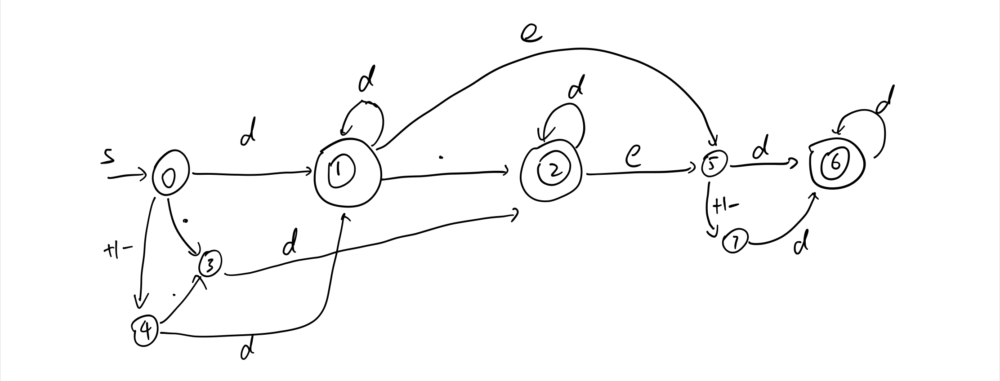

# 有效数字

判断一个字符串是否是有效数字，使用DFA来求解。

[原题连接](https://leetcode-cn.com/problems/valid-number/)

## DFA



## 代码

```c++
class Solution {
public:
    bool isNumber(string s) {
        int len=s.size(),idx=0;
        state=0;
        while(idx<len){
            if(isDigital(s[idx])){
                if(state==0||state==4){
                    state=1;
                }else if(state==3){
                    state=2;
                }else if(state==5||state==7){
                    state=6;
                }
            }else if(s[idx]=='e'||s[idx]=='E'){
                if(state==1||state==2){
                    state=5;
                }else{
                    return false;
                }
            }else if(s[idx]=='.'){
                if(state==0){
                    state=3;
                }else if(state==4){
                    state=3;
                }else if(state==1){
                    state=2;
                }else{
                    return false;
                }
            }else if(s[idx]=='+'||s[idx]=='-'){
                if(state==0){
                    state=4;
                }else if(state==5){
                    state=7;
                }else{
                    return false;
                }
            }else{
                return false;
            }
            idx++;
        }
        return state==1||state==2||state==6;
    }
private:
    bool isDigital(char c){
        return c>='0'&&c<='9';
    }
    int state;
};
```

